# Setup
## Install Arduino IDE
1. [Download](https://www.arduino.cc/en/software/)
2. [Guide](https://docs.arduino.cc/software/ide-v2/tutorials/getting-started/ide-v2-downloading-and-installing/)
3. [Finding our board](https://www.youtube.com/watch?v=z67mfL63e2M)

### Wireless Test
1. copy and paste [wireless test](wireless_test.cpp) file
2. change wifi SSID and password
3. upload (top left **right arrow** symbol)
4. open serial monitor (top right **magnifying glass** symbol)
5. choose **115200** baud (bottom right dropdown menu)
6. copy wifi **{IP Address}**
7. paste server link in browser **http://{IP Address}/L**
8. Press turn on and off light on server page

### Camera
1. [guide](https://lastminuteengineers.com/getting-started-with-esp32-cam/)


## PlatformIO + VS code plugin
1. [VS code](https://code.visualstudio.com/download?_exp_download=fb315fc982)
2. search and install PlatformIO plugin
3. Create a project
4. Choose device as **AIthinker ESP32 Cam**

### ESP32 Cam Blink Test
1. go to **(project)>src > main.cpp**
2. copy and paste [blink test](blink_test.cpp) file

3. build and upload
4. Disconnect cable to stop the test
5. delete previous processes in bottom right panel. (build) (upload) (monitor)
6. press clean (trash bin icon)


### Connect Wifi
1. go to **(project) > platformio.ini**
2. copy and paste under everything else
```
monitor_speed = 115200 // serial monitor will show garbled text *?xx??xxxxxx* if incorrect speed
monitor_rts = 0
monitor_dtr = 0
```
3. go to **(project)>src > main.cpp**
4. copy and paste [wifi scan](wifi_scan.cpp) file
5. build and upload
6. open serial monitor **(plug icon)**
7. network names and types will appear

   if garbled text appears, incorrect or mismatched speed.

# Design
- 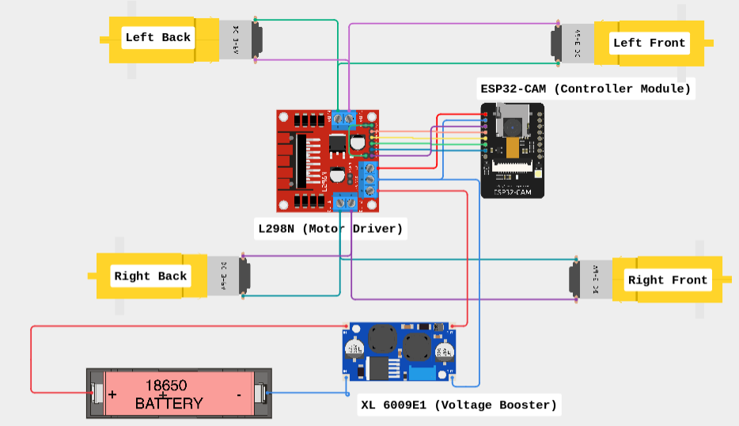
[Circuit Cesign](https://app.cirkitdesigner.com/project/c6ccce3c-a848-4c31-a3ae-477986d8f76b)
- 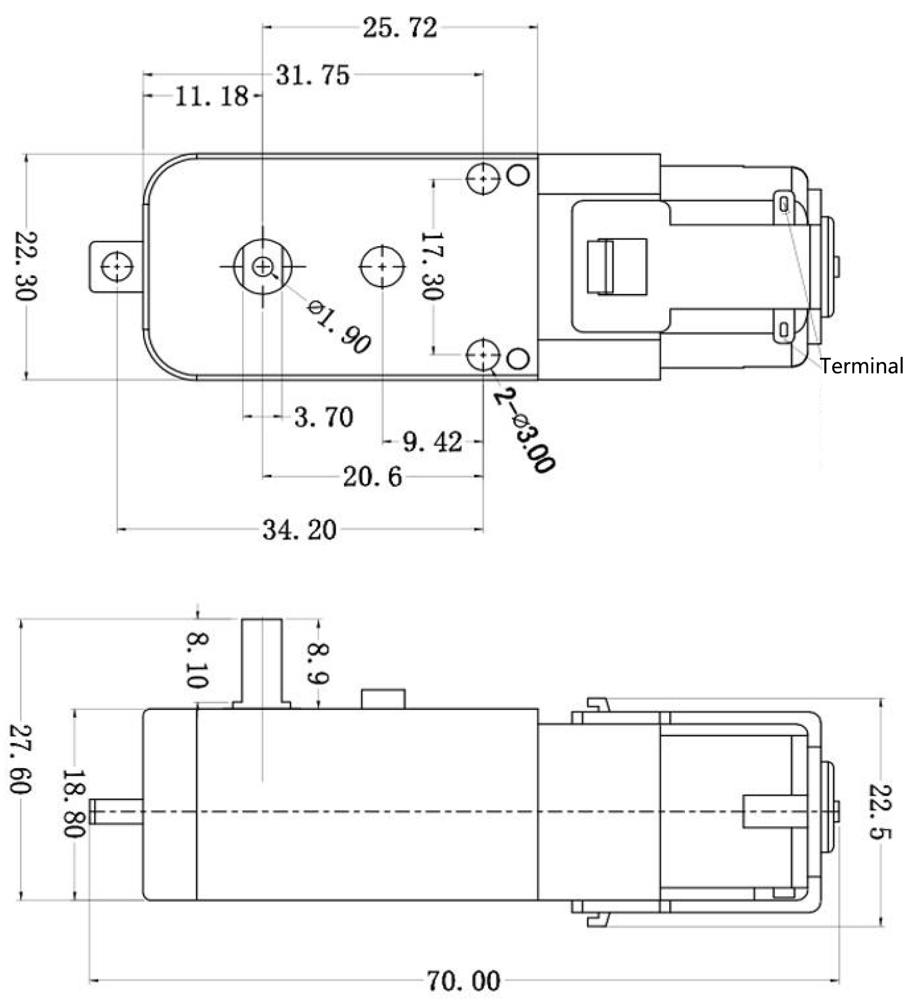
- 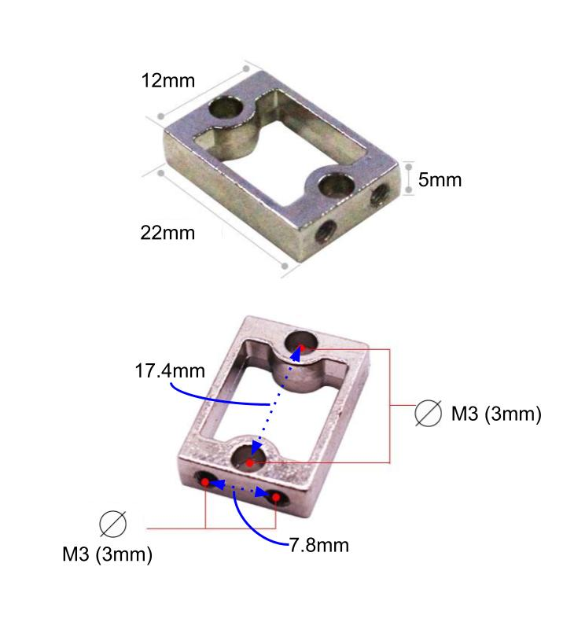

[OnShape Design](https://cad.onshape.com/documents/e64b89430876cdb7d6b69ab3/w/77c1ce2ce73c963871a615a2/e/e7f76abc5f1c2211f29a23ec?renderMode=0&uiState=6aaf8ad37668e8bcef2a1785)

## Container
### Outer Wall

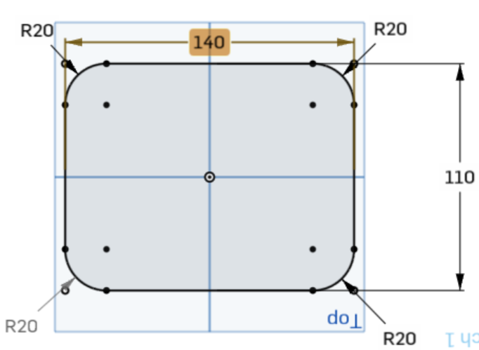
### Inner Wall

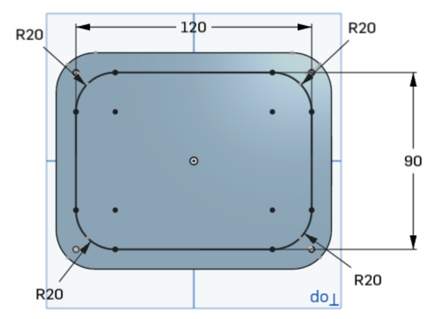
### Bolt Holes
[](https://github.com/user-attachments/assets/88bf8b61-e23b-4b81-b1c2-a49fef672c6e)
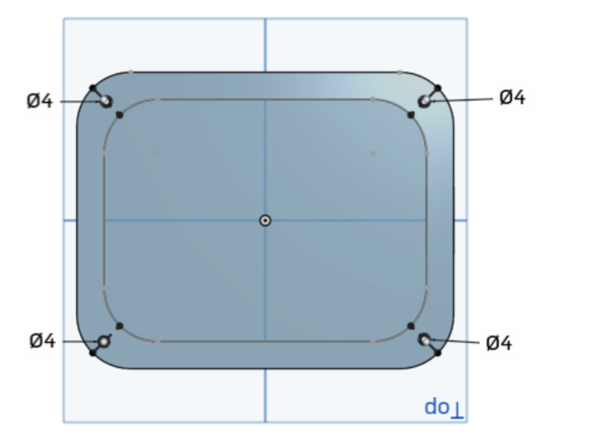
### Side Sketch
[side.webm](https://github.com/user-attachments/assets/8dae6a73-2e0c-4bf5-8855-766b844778cd)

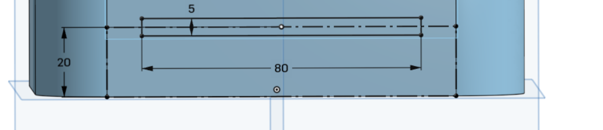
### Front
[](https://github.com/user-attachments/assets/03c82f17-2845-4009-8d1d-5a7f484af1d8
)
- 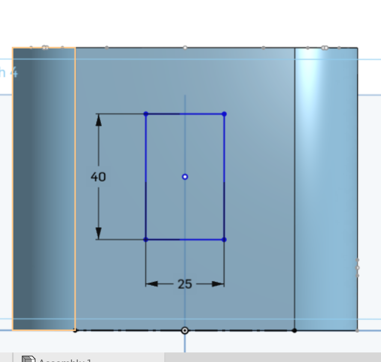
### Finished Container
- 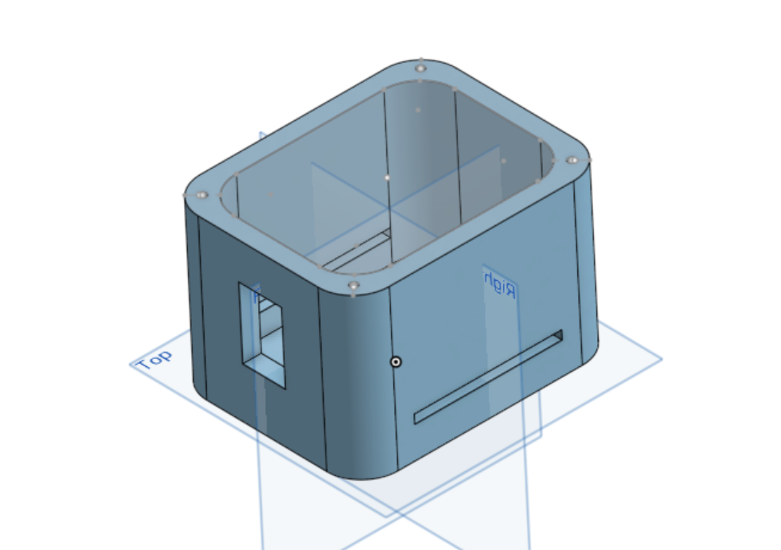

## Lid
[](https://github.com/user-attachments/assets/3f7f2bde-a309-4950-a11d-0ba88ebb1534)
### Cover
- 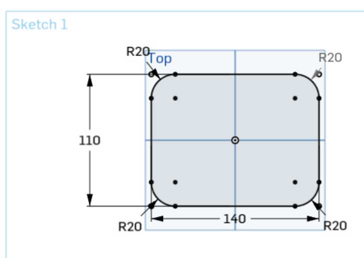
### Bolt Holes
- 
### Blank Lid
- 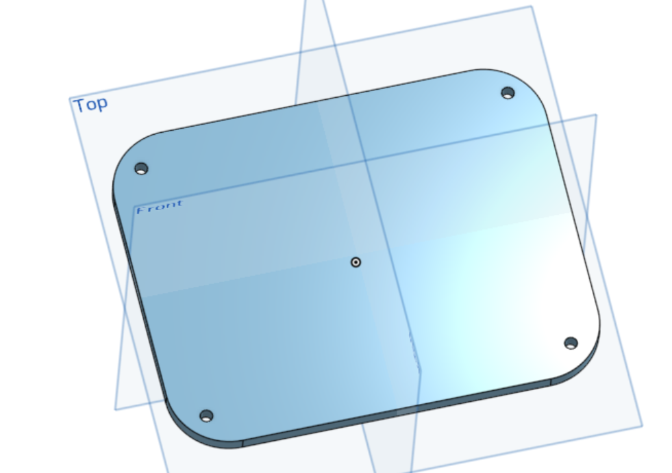
### Decorated Lid
- 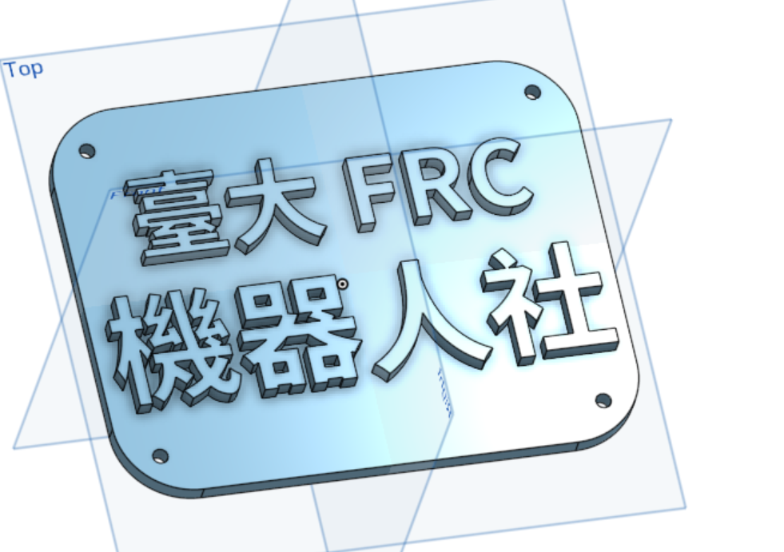

# Guides
- [ESP starter](https://deepbluembedded.com/getting-started-with-esp32-programming-tutorials/)
