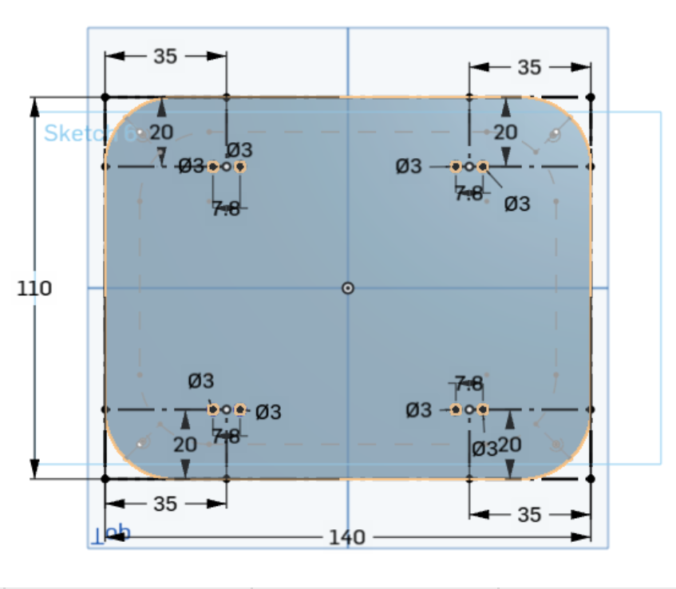

# Table of Contents
1. [Bill of Materials](#bom)
2. [ESP32-Cam Setup](#esp32-cam)
3. [3D Design](#3d-design)
   
   3.1 [Container](#container)

   3.2 [Lid](#lid)

6. [Circuit](#circuit)
7. [ESP Guide](#esp-guide)

# BOM
[v1.0](https://docs.google.com/spreadsheets/d/1K54std629R6cTmjSbiGCCC1N0AOHtXluDwHZW1lQWgc/edit?usp=sharing)

## L298N Motor Driver

  
## Q054 geared motor TT 130

  
## Q054 geared motor TT 130 Bracket


## Q016 rubber tire (20T65) 65MM


## XL6009 DC-DC Voltage Booster


## LM2596 DC-DC Voltage Bucker ( + Display + Screw Terminal Block )


## 18650 Battery


# ESP32-Cam
Arduino IDE OR VScode + PlatformIO Plugin
## Install Arduino IDE
1. [Download](https://www.arduino.cc/en/software/)
2. [Guide](https://docs.arduino.cc/software/ide-v2/tutorials/getting-started/ide-v2-downloading-and-installing/)
3. [Finding our board](https://www.youtube.com/watch?v=z67mfL63e2M)

### Wireless Test
1. copy and paste [wireless test](wireless_test.cpp) file
2. change wifi SSID and password
3. upload (top left **right arrow** symbol)
4. open serial monitor (top right **magnifying glass** symbol)
5. choose **115200** baud (bottom right dropdown menu)
6. copy wifi **{IP Address}**
7. paste server link in browser **http://{IP Address}/L**
8. Press turn on and off light on server page

### Camera
1. [guide](https://lastminuteengineers.com/getting-started-with-esp32-cam/)


## PlatformIO + VS code plugin
1. [VS code](https://code.visualstudio.com/download?_exp_download=fb315fc982)
2. search and install PlatformIO plugin
3. Create a project
4. Choose device as **AIthinker ESP32 Cam**

### ESP32 Cam Blink Test
1. go to **(project)>src > main.cpp**
2. copy and paste [blink test](blink_test.cpp) file

3. build and upload
4. Disconnect cable to stop the test
5. delete previous processes in bottom right panel. (build) (upload) (monitor)
6. press clean (trash bin icon)


### Connect Wifi
1. go to **(project) > platformio.ini**
2. copy and paste under everything else
```
monitor_speed = 115200 // serial monitor will show garbled text *?xx??xxxxxx* if incorrect speed
monitor_rts = 0
monitor_dtr = 0
```
3. go to **(project)>src > main.cpp**
4. copy and paste [wifi scan](wifi_scan.cpp) file
5. build and upload
6. open serial monitor **(plug icon)**
7. network names and types will appear

   if garbled text appears, incorrect or mismatched speed.


[OnShape Design](https://cad.onshape.com/documents/e64b89430876cdb7d6b69ab3/w/77c1ce2ce73c963871a615a2/e/e7f76abc5f1c2211f29a23ec?renderMode=0&uiState=6aaf8ad37668e8bcef2a1785)
# 3D-Design
1. Units are all in milimeters (mm)

## Container

### Outer Wall
[](https://github.com/user-attachments/assets/a5e99203-3ade-498d-809d-e49bd2d916f6)


### Inner Wall
[](https://github.com/user-attachments/assets/da4df0dd-af4f-4e59-848b-a63e858b195d)


### Top Holes
[](https://github.com/user-attachments/assets/27214523-afbd-4703-bcae-0e40a43c85ab)


### Side holes
[side.webm](https://github.com/user-attachments/assets/36426668-020c-44df-9053-4a59281ac936)


### Front hole
[](https://github.com/user-attachments/assets/d10900fe-48e4-41cb-896e-6aa9c3cc8334)


### Bottom boles



## Lid


[](https://github.com/user-attachments/assets/992a540b-3695-44bd-847e-d5f1035c15b0)

### Cover

### Holes

### Decorated Lid
- 
  
# Circuit
- 
[Circuit Design](https://app.cirkitdesigner.com/project/c6ccce3c-a848-4c31-a3ae-477986d8f76b)

  
# ESP-guide
- [ESP starter](https://deepbluembedded.com/getting-started-with-esp32-programming-tutorials/)
